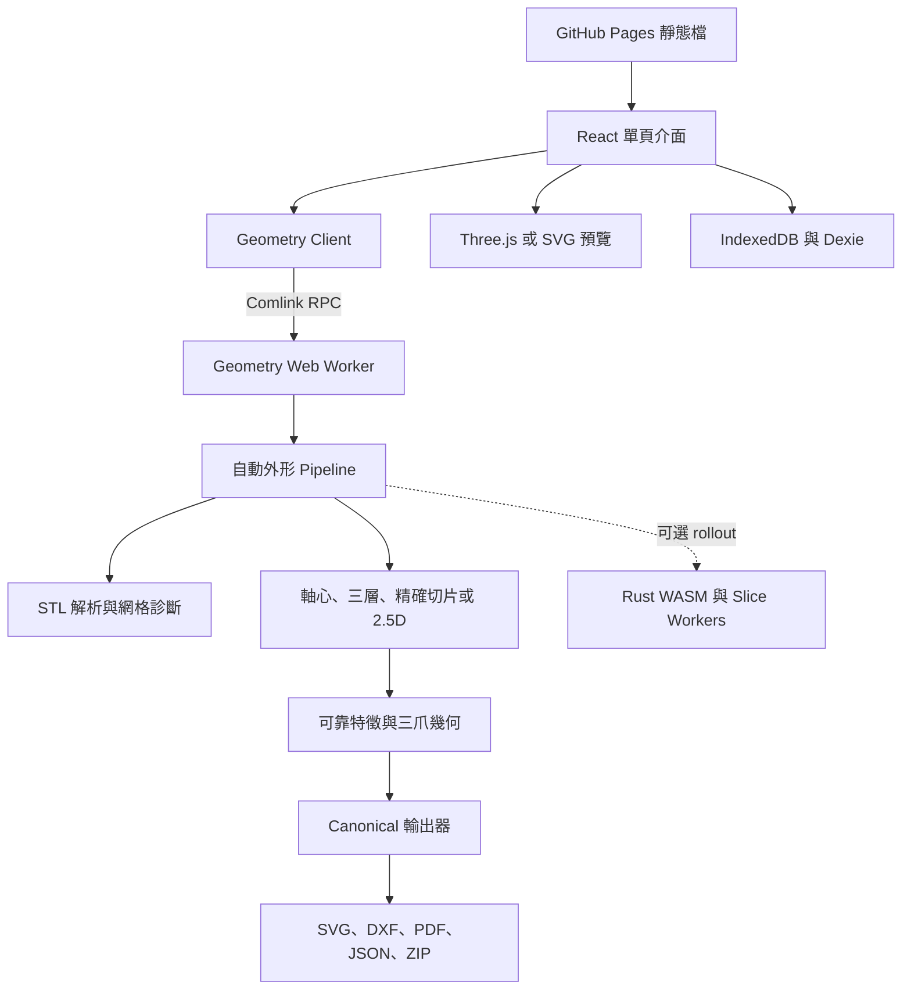
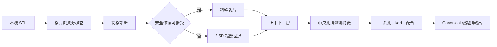

# ShapeCut

ShapeCut 是一個把 **3D 陀螺 STL 模型轉換成 Laser Cut 平面切片及製作檔案**的瀏覽器工具。它會分析模型、判定旋轉軸、建立上中下三層、保留可靠特徵、加入三爪發射器配合孔，並輸出 SVG、DXF、PDF、JSON 及 ZIP。

STL 幾何運算在使用者瀏覽器內完成，不會上載到 ShapeCut 後端或 GitHub Pages。軟件輸出並非官方產品認證；正式切割前必須核對材料、尺寸、kerf 及結構安全，並先試切三爪尺寸測試片。

## 線上測試

- [ShapeCut 公開工具](https://yuenhk.github.io/ShapeCut/)
- [sample1.stl](https://yuenhk.github.io/ShapeCut/samples/sample1.stl)
- [sample2.stl](https://yuenhk.github.io/ShapeCut/samples/sample2.stl)

範例只供測試工作流程，不代表已通過實體切割或官方發射器驗收。

## 使用流程

1. 拖放 STL，或按「選擇模型」。
2. 選擇材料及三爪配合微調；預設為 **6 mm 壓克力**。
3. 按「開始製作」，等待轉換完成後下載檔案。

| 材料 | 厚度 | 用途 |
| --- | ---: | --- |
| 壓克力（幾何估算） | 6 mm | 預設；幾何及堆疊估算 |
| 壓克力（幾何估算） | 3 mm | 幾何及堆疊估算 |
| 木（幾何估算） | 6 mm | 幾何及堆疊估算 |
| 木（幾何估算） | 3 mm | 幾何及堆疊估算 |

內置設定不是已校準的機器配方。三層的理論成品厚度為 18 mm 或 9 mm，與原 STL 高度是兩個不同概念。

## 結果狀態

| 狀態 | 意義 |
| --- | --- |
| 成功 · 精確切片 | 沿可信軸心，以通過安全檢查的網格精確切片。 |
| 需注意 · 精確切片 | 仍是精確切片，但軸心來自最短包圍盒回退。 |
| 需注意 · 2.5D 外形 | 修復未獲接納，改用原模型投影；部分內部細節可能省略。 |
| 失敗 | STL、資源、外形、三爪或輸出幾何不能安全成立。 |

完成畫面在單一工作視窗內顯示三層預覽、製作設定、技術資料、處理時間及下載。處理中可取消或換檔；換檔會終止舊 worker。Reduced motion 會停用非必要旋轉，WebGL 失敗時則回退至 SVG 預覽。

## 輸出

頁面提供六個下載：ZIP 製作套件、三爪尺寸測試片、SVG、DXF、平面預覽 PDF、爆炸圖 PDF。ZIP 包含：

```text
cut-and-engrave.svg
cut-and-engrave.dxf
preview.pdf
exploded-view.pdf
launcher-fit-coupon.svg
project.json
manifest.json
```

五項獨立製作檔與 ZIP 相應成員逐 byte 一致。所有格式由同一份 canonical 幾何生成；project／manifest 記錄來源、材料、層次、特徵及 fingerprint。

- 黑色 `CUT_BLACK`：外框、可靠中央孔、三爪孔及切割孔。
- 紅色 `DEEP_RED`：相對較深特徵。
- 藍色 `LIGHT_BLUE`：相對較淺特徵。

紅／藍不是雷射功率、速度或走刀次數。

## 系統架構



正式網站是純靜態 GitHub Pages，沒有 Node.js 幾何後端或上載 API。React 負責流程；幾何及封裝在 Web Worker 執行；IndexedDB 只在本機保存材料及專案決策。

## 運算資料流



### STL、網格與資源

`parse-stl.ts` 支援 binary／ASCII STL，不以 `solid` 檔頭武斷判型。輸入必須有有限座標、完整三角面及有效索引。預設上限是 128 MiB、500,000 個三角面及 300,000 個唯一頂點。

系統檢查邊界邊、非流形邊、退化／重複三角形、不一致繞向及自相交。修復結果須重新通過幾何規則才獲接納；否則保留原模型並使用明確標示的 2.5D 回退，避免把不可靠網格當成精確實體。

### 軸心與固定三層

系統先尋找達信心門檻的徑向對稱候選軸；沒有可信候選時使用最短包圍盒軸並顯示提示。切片平面以該軸建立正交基底，因此上中下不是硬編碼 STL 世界 Z 軸。

模型沿軸向等分為下層 0–33.33%、中層 33.33–66.67%、上層 66.67–100%，保留每層 `zStart/zMid/zEnd` 證據。來源取樣跨度不等於板材厚度。

### 精確切片與 2.5D

精確路徑求三角面與切片平面的交線，再建立及驗證輪廓。2.5D 路徑把原模型投影至垂直軸心的平面，以有界 raster 建立主要外形；上限包括 1024 × 1024 raster、16,777,216 cells、12,000,000 次三角面／分層檢查及每層 4,096 點。2.5D 是可驗證的外形近似，不是 CAD solid reconstruction。

中央孔必須有限、簡單、閉合、完全位於外框內、保持間距及接近軸心；等效直徑至少為 `max(0.5 mm, 層寬 1%)`。不可靠孔洞會省略。紅／藍深淺特徵若與受保護黑色結構衝突，裝飾會省略，結構優先。

### 三爪、kerf 與實體公差

三爪樣板是三組相同圓邊環形長孔，以 120° 等距排列，並有版本及 fingerprint。配合可由 -0.20 mm 至 +0.20 mm、每步 0.01 mm：正數較鬆，負數較緊。規劃會檢查 kerf、裝配餘量、外框包含、孔間距及最小剩餘結構；不安全時停止或省略不可靠的可選幾何。

內置 0.15 mm kerf 只是估算起點。正式製作須使用實際機器及同批材料量度 kerf、試切 coupon、實體試裝，再確認完整製作。

## Canonical 輸出原理

同一份 colored outline document 生成所有檔案。驗證器核對層次、ID、來源區段、材料、feature 角色／點列、fingerprint、SVG viewBox、DXF extents、PDF 結構、ZIP CRC／安全路徑及 byte identity。任何主要輸出失敗，整套封裝均視為失敗。

## Worker、取消、WASM 與持久化

Geometry Web Worker 透過 Comlink 接收工作，typed arrays 在合適位置以 transferable 移交。取消會釋放 proxy、終止 worker 並為下一工作重建，防止舊結果覆蓋新結果。

專案包含 Rust WASM 精確線段核心及最多四個 slice workers，也有 deterministic build、跨平台 regeneration、取消、記憶體及輸出測試；但 **production 仍預設使用 TypeScript 路徑**，WASM 只在明確 rollout／驗收開關下啟用。

Production 自動 outline 沒有固定時間上限，但檔案、三角面、頂點、raster、輪廓點及工作量仍有限制，輸出器亦保留 deadline／取消檢查。這不保證任何 STL 都能完成。

Dexie／IndexedDB 保存材料、三爪偏移、模板版本、來源 hash 及決策，不保存可供重新產生的原 STL；模板更新後需要重新連結原檔。Service worker 只快取同源靜態 shell，不快取使用者 STL。

## 技術棧與目錄

| 層次 | 技術 |
| --- | --- |
| UI／預覽 | React 19、TypeScript、Zustand、Three.js |
| 背景運算 | Web Workers、Comlink |
| 本機資料 | IndexedDB、Dexie、Zod |
| 幾何核心 | TypeScript；Rust／WASM rollout 基礎 |
| 輸出 | JSZip、pdf-lib、自有 SVG／DXF 產生器 |
| 測試／發佈 | Vitest、Playwright、Rust tests、GitHub Actions／Pages |

```text
src/app/                  UI、流程與結果
src/domain/mesh/          STL、診斷及修復
src/domain/axis/          旋轉軸候選
src/domain/outline-2.5d/  三層、切片、投影及輪廓
src/domain/outline-features/ 孔及深淺特徵
src/domain/outline-assembly/ 三爪、kerf 及保護區
src/workers/              Geometry／slice workers 及 RPC
src/wasm/                 WASM contract 及固定生成檔
src/export/               SVG、DXF、PDF、JSON、ZIP
src/persistence/          IndexedDB repositories
src/preview/              Three.js／SVG 預覽
crates/geometry-wasm/     Rust 幾何核心
e2e/                      完整流程及效能驗收
docs/validation/          發佈、效能及實體證據
```

## 測試與效能

```bash
npm test
npm run test:browser -- --run
npm run test:e2e
npm run validate:fixtures:public
npm run test:performance
npm run test:geometry-wasm-boundary
npm run typecheck
SHAPECUT_BASE_PATH=/ShapeCut/ npm run build
```

測試覆蓋 Node 單元／整合、真實 Chromium worker、Playwright 上載與六下載、ZIP 七成員、公開 fixtures、Rust／WASM、取消、記憶體、回應性、封裝一致性及隱私。需要私有驗收模型的 `validate:fixtures` 是發佈 gate；一般開發使用 `validate:fixtures:public`。

2026-09-05 的同主機 Node 純轉換量測中，兩個外部參考模型由 14.232 s／14.701 s 降至 9.612 s／9.994 s，即減少 32.5%／32.0%，canonical 輸出不變。這不含 PDF／ZIP、不是所有裝置保證，也不證明 WASM 已啟用或實體配合已通過。詳見[2.5D 優化](docs/validation/2026-09-05-projected-optimization.md)、[版本驗證](docs/validation/2026-09-05-optimized-release.md)及[WASM 證據](docs/validation/wasm-geometry-release-evidence.json)。

## GitHub Actions 與 Pages

Push 到 `main` 會執行兩條流程：

1. **ShapeCut release gates**：Node.js 24、Rust 1.98.0、wasm-pack 0.15.0、Rust／WASM、型別、serial Node、Chromium、release evidence、build 及 privacy scan。
2. **Deploy ShapeCut to GitHub Pages**：Linux deterministic WASM 重建、瀏覽器及 release gates 全部成功後才部署 `dist/`。

```bash
SHAPECUT_BASE_PATH=/ShapeCut/ npm run build
```

部署成功只證明軟件關卡及公開版本，不代替私有模型、材料、雷射機或發射器驗收。

## 隱私、安全與限制

- STL 留在瀏覽器；私有路徑、模型幾何及 hash 不應進入公開證據。
- 未知成分材料不得切割；內置功率／速度不是生產設定。
- 小型分離零件及不可靠內部細節可能省略；自動軸心未必適合非陀螺模型。
- 三層不會重建原模型的連續曲面；效能受 CPU、RAM、熱限制及瀏覽器影響。
- 三爪已有軟件幾何驗證，但不是官方認證，必須實體試切。

詳見[材料與雷射安全](docs/materials/safety.md)及[實體樣本驗收表](docs/validation/physical-sample-form.md)。

## 本機開發

需要 Node.js 20 或以上；CI 使用 Node.js 24。

```bash
git clone https://github.com/YuenHK/ShapeCut.git
cd ShapeCut
npm ci
npm run dev
```

`localhost`／`127.0.0.1` 只代表本機；開發伺服器停止或連接埠不同時，瀏覽器會拒絕連線。

## 開源授權

ShapeCut 以 [MIT License](LICENSE) 開源。任何人均可在保留版權及授權聲明的前提下使用、複製、修改、合併、出版、散布、再授權及銷售軟件副本。軟件按「現狀」提供，不附帶任何明示或默示保證。
