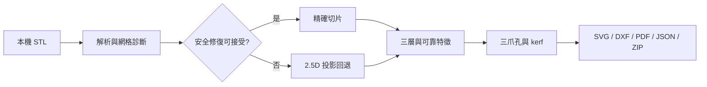

# ShapeCut 完整繁體中文 README 實現計劃

> **面向 AI 代理的工作者：** 必需子技能：使用 superpowers:subagent-driven-development（推薦）或 superpowers:executing-plans 逐任務實現此計劃。步驟使用復選框（`- [ ]`）語法來跟蹤進度。

**目標：** 以可驗證的繁體中文 README 完整說明 ShapeCut 測試網站、使用方法、架構、幾何運算、輸出、測試與部署。

**架構：** README 採分層閱讀，由使用者快速入門逐步深入至領域運算及工程驗證。技術內容以目前 TypeScript、Rust/WASM、Web Worker、IndexedDB、匯出器及 GitHub Actions 原始碼為準，效能敘述只引用版本庫內的驗證證據。

**技術棧：** Markdown、Mermaid、React 19、TypeScript、Vite、Three.js、Comlink、Dexie、Rust/WASM、Vitest、Playwright、GitHub Actions、GitHub Pages。

---

## 文件結構

- 修改：`README.md` — 公開專案首頁、操作與完整技術說明。
- 參考：`docs/validation/*.md` — 效能與發佈證據。
- 參考：`src/domain/**`、`src/export/**`、`src/geometry-worker/**` — 運算及封裝真實行為。
- 參考：`.github/workflows/*.yml` — CI 與 Pages 發佈關卡。

### 任務 1：建立完整 README

- [ ] **步驟 1：核對公開功能與架構來源**

執行：

```bash
rg -n "開始製作|DEFAULT_|layerCount|Web Worker|WASM|IndexedDB|ZIP|launcher" README.md src package.json .github/workflows docs/validation
```

預期：能定位 UI、三層、材料、worker、WASM、封裝及 release gate 的直接證據。

- [ ] **步驟 2：重寫 README**

依 `docs/superpowers/specs/2026-09-06-complete-chinese-readme-design.md` 寫入完整章節，包含以下資料流：



- [ ] **步驟 3：執行文件一致性掃描**

執行：

```bash
rg -n "選擇檔案會立即開始|ZIP 內五項|TODO|待定" README.md
```

預期：沒有匹配。

- [ ] **步驟 4：核對連結及 Markdown**

執行本機腳本，擷取 README 的相對連結並確認目標存在；同時確認 Mermaid 圍欄、標題及程式碼圍欄成對。

預期：所有相對檔案連結存在，所有圍欄成對。

- [ ] **步驟 5：執行專案驗證**

執行：

```bash
npm run typecheck
SHAPECUT_BASE_PATH=/ShapeCut/ npm run build
git diff --check
```

預期：三項均成功。

- [ ] **步驟 6：提交並推送**

```bash
git add README.md docs/superpowers/plans/2026-09-06-complete-chinese-readme.md
git commit -m "docs: publish complete Chinese project guide"
git push origin main
```

- [ ] **步驟 7：發佈後驗證**

等待 `ShapeCut release gates` 與 `Deploy ShapeCut to GitHub Pages` 完成，然後重新讀取 GitHub `main` 的 README，確認公開內容與本機提交一致。
